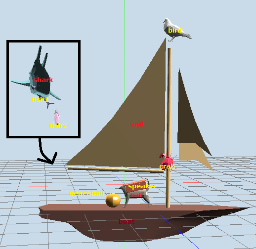
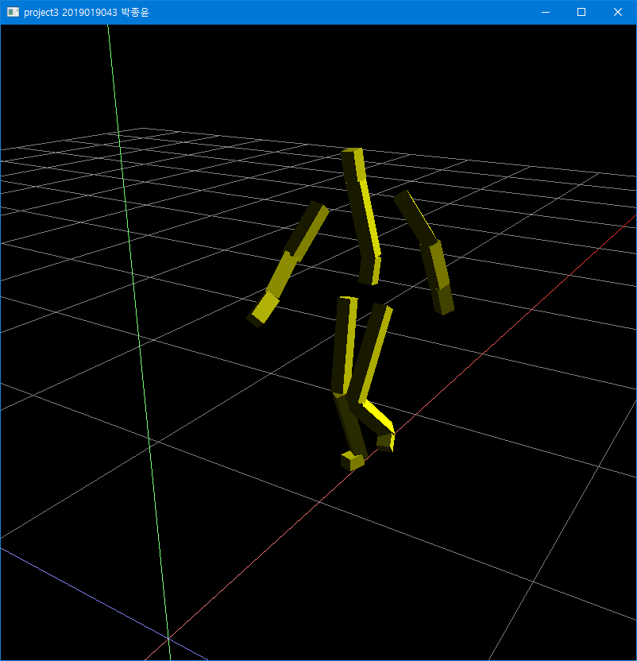

# Computer Graphics Projects Overview

이 저장소는 컴퓨터 그래픽스를 배우며 진행한 세 가지 프로젝트를 포함하고 있습니다.  
| Project2 실행 예시 | Project3 실행 예시 |
|----------------|-------------------|
|  |  |
|[Project2 실행 예시 영상](https://www.youtube.com/shorts/pPaTJ1bImMg)|[Project3 실행 예시 영상](https://www.youtube.com/shorts/M6AmCLtrXGE)|

## Project 1: Basic OpenGL viewer
이 프로젝트는 Blender의 조작 방식을 참고하여 Basic OpenGL viewer를 만드는 것을 목표로 합니다.
### 주요 기능
- **카메라 조작**: Orbit, Pan, Zoom 기능을 제공하며, 마우스 조작을 통해 카메라를 자유롭게 움직일 수 있습니다.
- **투영 전환**: 원근 투영과 직교 투영을 V키로 전환할 수 있습니다.
- **격자 그리기**: XZ 평면에 21x21 격자를 생성하여 3D 공간의 참조 바닥면을 제공합니다.

## Project 2: OBJ Viewer & Hierarchical Model Animation

이 프로젝트는 OBJ 파일을 로드하여 뷰어에 렌더링하는 기능과, 계층적 모델을 애니메이션을 구현합니다.

### 주요 기능
- **OBJ 파일 뷰어**: Drag-and-drop 방식으로 OBJ 파일을 로드하여 단일 메시를 렌더링합니다.
- **계층적 모델 애니메이션**: 서로 다른 OBJ 파일로 구성된 3레벨의 계층 모델을 애니메이션으로 렌더링합니다.
- **렌더링 모드 전환**: 1번 키로 라인 렌더링, 2번 키로 박스 렌더링 모드로 전환할 수 있습니다.
- **조명 및 셰이딩**: Phong Illumination과 Phong Shading을 적용하여 사실적인 조명 효과를 구현했습니다.

## Project 3: BVH Viewer

이 프로젝트는 BVH 파일을 로드하여 스켈레톤을 렌더링하고 애니메이션을 구현하는 BVH 뷰어를 구현합니다.

### 주요 기능
- **BVH 파일 로드**: Drag-and-drop 방식으로 BVH 파일을 로드하여 스켈레톤의 기본 자세(rest pose)를 렌더링합니다.
- **애니메이션**: Spacebar를 눌러 BVH 파일의 모션 데이터를 기반으로 스켈레톤 애니메이션을 실행합니다.
- **렌더링 모드 전환**: 1번 키로 라인 렌더링 모드, 2번 키로 박스 렌더링 모드로 전환할 수 있습니다.
- **보조선**: 3번 키로 보조선을 켜거나 끌 수 있습니다.

## 사용된 기술
- Python 3.8
- OpenGL 3.3 Core Profile
- GLFW
- PyGLM
- NumPy
