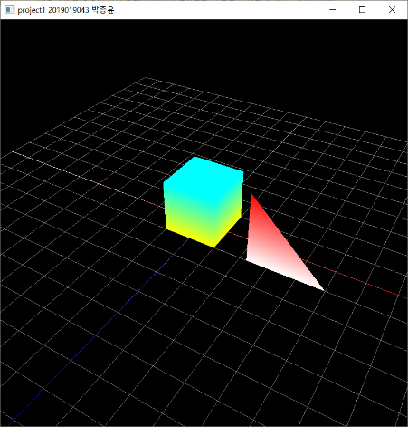
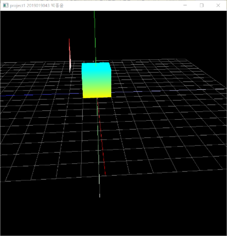
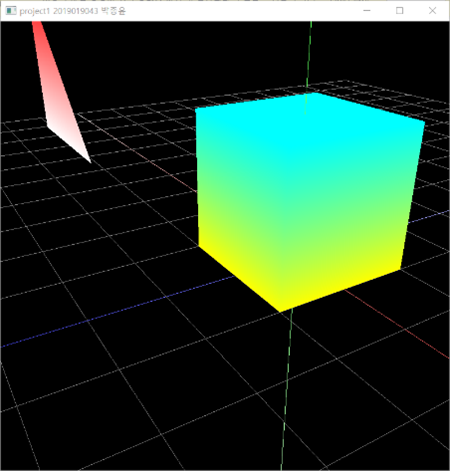
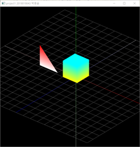

# Computer Graphics Project 1: Basic OpenGL viewer

이 프로젝트는 Blender의 조작 방식을 참고하여 Basic OpenGL viewer를 만드는 것을 목표로 합니다.

## 프로젝트 기능

1. **Orbit (궤도 이동)**
    - 마우스 우클릭을 한 상태에서 커서를 움직이면 카메라의 azimuth(방위각)와 elevation(고도각)이 변경됩니다.
    - 이 값들을 기반으로 카메라가 궤도에 따라 이동하게 되며, 이를 통해 3D 객체를 다양한 각도에서 관찰할 수 있습니다.

2. **Pan (팬 이동)**
    - 마우스 좌클릭을 한 상태에서 커서를 움직이면 카메라가 상하좌우로 이동합니다. 
    - 카메라의 up 벡터와 right 벡터를 계산하여 이 방향으로 팬 이동이 이루어집니다.

3. **Zoom (줌)**
    - 마우스 스크롤을 통해 카메라와 타겟 간의 거리를 조절할 수 있습니다.

4. **Perspective 및 Orthogonal Projection**
    - V키를 입력하면, 카메라의 투영 방식이 원근 투영(perspective)과 직교 투영(orthogonal) 간에 전환됩니다.

5. **Grid (격자)**
    - 21x21의 그리드(격자)를 생성하여 3D 공간의 좌표를 쉽게 파악할 수 있도록 도와줍니다.

6. **추가 구현 사항**
    - XYZ 축을 표시하였으며, 정지된 박스와 움직이는 삼각형 객체를 구현하여 3D 환경에서의 기본적인 애니메이션을 확인할 수 있습니다.

## 실행 화면

| 기본 화면 | 카메라 이동 | 줌 | orthogonal projection mode
|-----------|-------------|----|----|
|  |  |  |  |
