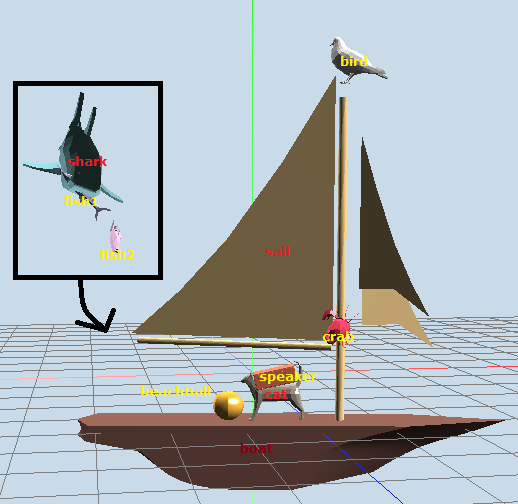

# Computer Graphics Project 2: OBJ Viewer & Hierarchical Model

이 프로젝트는 OBJ 파일을 로드하여 뷰어에 렌더링하는 기능과, 계층적 모델을 애니메이션으로 표현하는 기능을 구현합니다.

## 프로그램 기능

1. **OBJ 파일 뷰어**
   - Drag-and-drop 방식으로 OBJ 파일을 로드하여 단일 메시를 렌더링할 수 있습니다.
   - 로드된 OBJ 파일의 정보 (파일 이름, 면의 총 개수, 3각형/4각형/다각형 면의 개수)를 터미널에 출력합니다.
   - Z키를 눌러 와이어프레임 모드와 솔리드 모드를 전환할 수 있습니다.

2. **Hierarchical Model Animation**
   - H키를 눌러 계층적 모델 애니메이션 모드로 전환할 수 있습니다. (처음 시작 시 애니메이션이 자동으로 재생됩니다.)
   - 각 자식 노드는 부모 노드에 상대적인 움직임을 가집니다.
   - 애니메이션은 자동으로 진행되며 사용자 입력 없이도 동작합니다.

3. **조명 및 셰이더**
   - Phong Illumination과 Phong Shading을 사용하여 객체를 렌더링합니다.
   - 2개의 광원(위치: (100, 100, 100), (-100, 100, -100))을 사용하여 다중 광원 효과를 구현했습니다.

## 실행 방법

1. Python 3.8 환경에서 프로그램을 실행합니다.
2. OBJ 파일을 뷰어 창으로 드래그 앤 드롭하여 단일 메시를 렌더링합니다.
3. H키를 눌러 계층적 모델 애니메이션 모드를 활성화할 수 있습니다.
4. Z키를 사용하여 와이어프레임/솔리드 모드를 전환할 수 있습니다.

## 그림 예시 및 실행 화면

| Hierarchical Model | Hierarchical Model Animation | Single Mesh Rendering (shark.obj) |
|----------------|-------------------|-------------------|
|  |  |  |

[실행 예시 YouTube Link](https://www.youtube.com/shorts/pPaTJ1bImMg)